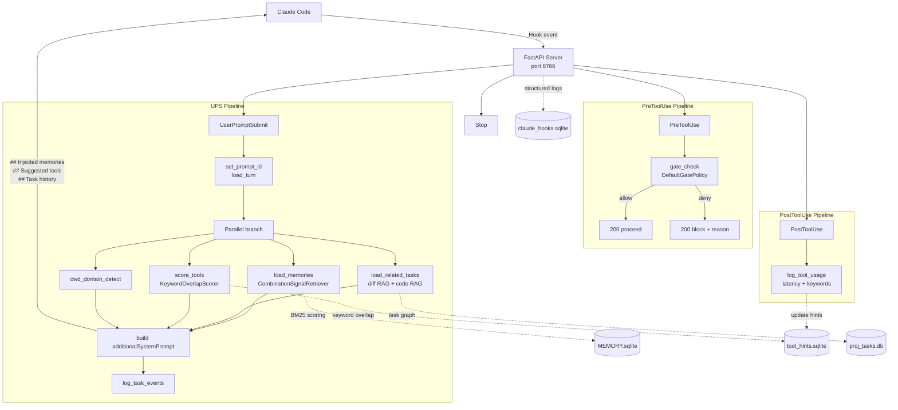

# claude-hooks Architecture

> This document describes the system as built — the decisions made, why they were made, and the constraints that shaped the design. The structural/behavioral claims below are backed by a validated SysML v2 model in `docs/models/` (source of truth for structure/state/requirements/sequence — this page explains it, it doesn't restate it informally).

---

## Overview

`claude-hooks` is a Python system that intercepts all four Claude Code hook events and runs a **LangGraph StateGraph pipeline** in response. Its responsibilities are:

1. **Memory injection** — score and inject relevant memories from `MEMORY.sqlite` into every prompt
2. **Tool hint surfacing** — retrieve relevant MCP tools based on prompt intent and domain
3. **Anti-hallucination gating** — hard-block irreversible MCP tool calls unless a prerequisite tool actually ran this prompt
4. **Tool usage tracking** — accumulate latency and keyword signals per MCP tool for future retrieval
5. **Task tracking** — inject persistent work context (history, code chunks, memories) for the active task

---

## Formal Model (SysML v2)

Validated via `jupyter console --kernel=sysml` (the SysML v2 Pilot Implementation's kernel — see the MBSE learning epic that produced these, task:7af08b6b). Each `.sysml` file below parses and validates with zero errors against the real SysML v2 metamodel — not diagrams-as-illustration, a checked model.

### Subsystems (Block Definition Diagram equivalent)

Five subsystems, each composing a shared `Foundation` (config, DB schema, logging — cross-cutting, not a peer subsystem), composed into a top-level `System` part.

`docs/models/foundation.sysml` + `docs/models/claude_hooks_system.sysml`:

```sysml
package ClaudeHooksSystem {
    private import Foundation::Foundation;

    part def HookServer {
        // FastAPI server (hooks/server.py), event dispatcher, 3 gates,
        // session memory timeline. Owns the LangGraph checkpointer lifecycle.
        part foundation : Foundation;
    }
    part def MCPTools {
        // FastMCP dispatcher (src/dispatcher.py), 8 domains / 51 actions.
        part foundation : Foundation;
    }
    part def TaskGraph {
        // Jira-style issue tracking backed by proj_tasks.db.
        part foundation : Foundation;
    }
    part def MemoryConceptRAGStores {
        // Three distinct stores: memory (MEMORY.sqlite, BM25), concept
        // (concepts.json), RAG (code_rag/diff_rag, shared TurboVec core).
        part foundation : Foundation;
    }
    part def LangGraphPipeline {
        // StateGraph(SessionState), ~28 nodes, MemorySaver checkpointer.
        part foundation : Foundation;
    }
    part def System {
        part hookServer : HookServer;
        part mcpTools : MCPTools;
        part taskGraph : TaskGraph;
        part stores : MemoryConceptRAGStores;
        part pipeline : LangGraphPipeline;
        part foundation : Foundation;
    }
}
```

Full source with all `doc` comments and provenance: [`docs/models/claude_hooks_system.sysml`](models/claude_hooks_system.sysml), [`docs/models/foundation.sysml`](models/foundation.sysml).

### Task lifecycle (state machine)

Transcribed directly from `src/tools/tasks.py`'s `_TRANSITIONS` table — not inferred. `doneState`/`abandonedState` are terminal; any non-terminal state can transition to `abandonedState`.

```sysml
state def TaskLifecycle {
    entry;
    state openState;
    state blockedState;
    state doneState;
    state abandonedState;

    transition openToDone first openState then doneState;
    transition openToBlocked first openState then blockedState;
    transition blockedToOpen first blockedState then openState;
    transition openToAbandoned first openState then abandonedState;
    transition blockedToAbandoned first blockedState then abandonedState;
}
```

Full source: [`docs/models/task_lifecycle.sysml`](models/task_lifecycle.sysml).

### Requirements traceability

Six requirements, each `satisfy`'d by a subsystem part, sourced from a mix of this document's own prose and `concept_store/concepts.json` invariants (see the file for full sourcing citations per requirement — every one cites its origin, none invented):

| Requirement | Source | Satisfied by |
| --- | --- | --- |
| `CommitTaskTraceabilityRequirement` | concepts: `gates-commit-traceability`, `commit-task-traceability-capture` | `hookServer`, `taskGraph` |
| `AdditiveOnlyMigrationRequirement` | concept: `db-schema-ddl-and-migrations` invariant | `foundation` |
| `LogReadViaMCPOnlyRequirement` | this doc's "Observability" section | `mcpTools` |
| `CheckpointNonPersistenceRequirement` | this doc's "Development Workflow" section | `pipeline` |
| `MemoryScoringPerDomainRequirement` | concept: `memory-scoring-per-domain-batch-limit` | `stores` |
| `JiraHierarchyRequirement` | concept: `gates-jira-hierarchy` | `taskGraph`, `hookServer` |

Full source: [`docs/models/requirements.sysml`](models/requirements.sysml).

### UserPromptSubmit sequence

SysML v2's textual notation has no distinct sequence-diagram keyword — an `action def` with explicit `first`/`then` successions is the closest fit. Ground truth: `hooks/dispatcher.py:_handle_user_prompt_submit()` and `langchain_learning/session_graph.py:build_session_graph()`.

```sysml
action def UserPromptSubmitFlow {
    action clientForward;        // hooks/client.py forwards payload to server
    action serverRoute;          // hooks/server.py routes to dispatcher
    action dispatcherCheckState; // reads checkpoint state pre-invoke
    action graphInvoke;          // session_graph.py:run_session() — the StateGraph
    action loadVaultContext;     // dispatcher adds vault_context post-graph
    action enforceContextBudget; // trims to token/char budget
    action formatSystemPrompt;   // assembles additionalSystemPrompt text
    action injectResponse;       // server -> client -> Claude Code

    first clientForward then serverRoute;
    first serverRoute then dispatcherCheckState;
    first dispatcherCheckState then graphInvoke;
    first graphInvoke then loadVaultContext;
    first loadVaultContext then enforceContextBudget;
    first enforceContextBudget then formatSystemPrompt;
    first formatSystemPrompt then injectResponse;
}
```

Full source: [`docs/models/user_prompt_submit_flow.sysml`](models/user_prompt_submit_flow.sysml).

**A prior version of this section named `hooks/memory_loader_lc.py` as an "LCEL pipeline."** That file does not exist anywhere in this repo — it belongs to a separate, global `~/.claude/` memory system unrelated to claude-hooks. The graph above (a LangGraph `StateGraph`, not LCEL — no LCEL usage exists anywhere in this repo) is the real mechanism.

**Reading the models yourself:** these are plain text — readable without tooling for the structure/names/comments — but full parse/semantic validation requires the SysML v2 Pilot Implementation's Jupyter kernel (`jupyter console --kernel=sysml`; setup notes in the MBSE epic, task:7af08b6b) or a SysML v2-capable IDE (Eclipse Papyrus).

---

## Design Principles

- **Hooks orchestrate; MCP servers own domain logic.** Project databases stay inside MCP servers — hooks never reach across that boundary.
- **All safety decisions are deterministic and explainable.** Gate checks are rule-based, not probabilistic.
- **Session state is the source of truth.** `SessionState` fields in the LangGraph checkpoint carry all cross-hook context — no DB-as-IPC.
- **Modular graph nodes that can evolve independently.** Each node is a callable class; adding behavior means adding a node, not editing existing ones.

---

## Design Constraints

- Low-latency execution on every hook — every millisecond is user-perceived latency
- Persistent session state across prompts without relying on Claude's in-context memory
- No direct access to project databases — hooks only touch their own DBs
- Deterministic gate evaluation — no heuristics that can false-positive on normal prompts
- Modular graph nodes that can evolve independently without coupling

---

## Extensibility

The architecture is designed to support:

- Additional gate policies (a new internal `Gate` class, or just a `~/.claude/gate_rules.yaml` entry for external tools — no code change)
- New memory retrieval strategies (swap `CombinationSignalRetriever` via Protocol)
- Multiple MCP servers and domains
- Richer task graphs and subtask hierarchies
- Improved retrieval algorithms (BM25 → hybrid or vector)
- Additional observability pipelines

---

## System Diagram



---

## Sections

- [State Architecture](arch/state.md) — FastAPI persistent server, SqliteSaver as the checkpoint store, SessionState fields
- [Graph & Pipeline](arch/graph_pipeline.md) — Graph topology, UPS pipeline, domain classification, anti-hallucination gate, tool tracking
- [System Prompt](arch/system_prompt.md) — All `additionalSystemPrompt` sections and what populates them
- [Task Framework](arch/task_framework.md) — Task lifecycle, the `/task-grooming` → `/task-implementation` → `/task-introspection` skill trio, Execution Contract, mid-task decision tracking
- [Databases, MCP & Observability](arch/databases.md) — Database files, MCP tool hosting, logging architecture
- [Gates](arch/gates.md) — Internal gate classes + external `gate_rules.yaml` gates (iMessage, Mail), worked examples, how to add a new one
- [MCP / Hooks Boundary](arch/mcp_hooks_boundary.md) — Ownership rule: MCP owns domain DBs, hooks own checkpoint; PostToolUse bridge nodes
- [Design Decisions](arch/design_decisions.md) — Key choices and rationale; what this system is not
- [New Repo Onboarding](new_repo_onboarding.md) — How to register a new project into `cwd_domains.json` and seed memories
- [Setup Guide](setup.md) — Getting claude-hooks running from scratch; database creation, hook registration, env vars

**Caveat on staleness:** unlike `concept_store/concepts.json` (auto drift-checked on every Edit/Write), the SysML models in `docs/models/` have no drift detection — they're a snapshot as of task:7af08b6b's epic, not automatically kept in sync with code changes. Treat them as "validated at time of writing," and re-derive if this section's subsystem/requirement/transition claims look stale against current code.
