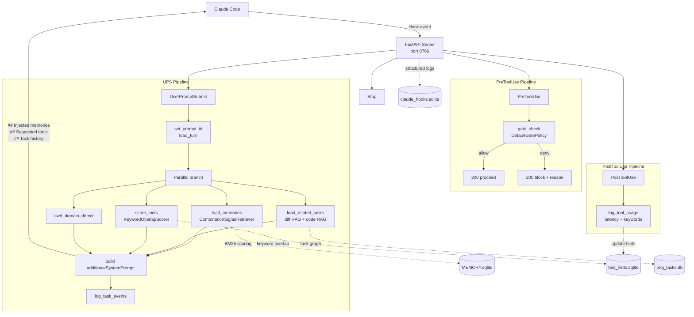

# claude-hooks Architecture

> This document describes the system as built — the decisions made, why they were made, and the constraints that shaped the design.

---

## Overview

`claude-hooks` is a Python system that intercepts all four Claude Code hook events and runs a **LangGraph StateGraph pipeline** in response. Its responsibilities are:

1. **Memory injection** — score and inject relevant memories from `MEMORY.sqlite` into every prompt
2. **Tool hint surfacing** — retrieve relevant MCP tools based on prompt intent and domain
3. **Anti-hallucination gating** — hard-block irreversible MCP tool calls unless a prerequisite tool actually ran this prompt
4. **Tool usage tracking** — accumulate latency and keyword signals per MCP tool for future retrieval
5. **Task tracking** — inject persistent work context (history, code chunks, memories) for the active task

---

## Subsystems

Five subsystems, each composing a shared `Foundation` (config, DB schema, logging — cross-cutting, not a peer subsystem), composed into a top-level system: `HookServer` (FastAPI server, event dispatcher, 3 gates, session memory timeline — owns the LangGraph checkpointer lifecycle), `MCPTools` (FastMCP dispatcher, 9 domains / 56 actions), `TaskGraph` (Jira-style issue tracking backed by `proj_tasks.db`), `MemoryConceptRAGStores` (four distinct persistent stores: memory/`MEMORY.sqlite`/BM25 — per-turn UPS scoring, `feedback`/`user`/non-repo-domain facts only since task:850ddd65; repo_memory/`repo_memory/memories.json` — per-repo committed store for `project`/`reference` facts, lifecycle-scoped only (task-activation/grooming/introspection), never per-turn scored; concept/`concepts.json`; RAG/code_rag+diff_rag on a shared TurboVec core), and `LangGraphPipeline` (`StateGraph(SessionState)`, ~28 nodes, `MemorySaver` checkpointer after a prior `SqliteSaver` corrupted).

## Task lifecycle

Transcribed directly from `src/tools/tasks.py`'s `_VALID_STATUSES`/`_TRANSITIONS`/`is_valid_transition` — not inferred. New tasks always start `open`; `done`/`abandoned` are terminal; any non-terminal state can transition to `abandoned` (special-cased in code rather than listed per-state). Not modeled as a same-task transition: parent auto-close-on-all-subtasks-done is a cross-task side effect (`handle_finish`).

## Requirements traceability

Six requirements, each satisfied by a subsystem, sourced from a mix of this document's own prose and `concept_store/concepts.json` invariants:

| Requirement | Source | Satisfied by |
| --- | --- | --- |
| Commit ↔ task traceability | concepts: `gates-commit-traceability`, `commit-task-traceability-capture` | `HookServer`, `TaskGraph` |
| Additive-only migrations | concept: `db-schema-ddl-and-migrations` invariant | `Foundation` |
| Logs readable only via MCP | this doc's "Observability" section | `MCPTools` |
| Checkpoint non-persistence | this doc's "Development Workflow" section | `LangGraphPipeline` |
| Memory scoring per-domain limit | concept: `memory-scoring-per-domain-batch-limit` | `MemoryConceptRAGStores` |
| Jira-style hierarchy | concept: `gates-jira-hierarchy` | `TaskGraph`, `HookServer` |

## UserPromptSubmit sequence

Ground truth: `hooks/dispatcher.py:_handle_user_prompt_submit()` and `langchain_learning/session_graph.py:build_session_graph()`. Eight ordered steps: client forwards the payload → server routes to the dispatcher → dispatcher reads existing checkpoint state → the StateGraph runs (`load_turn` → task loaders → fan-out `cwd_domain_detect`/`load_memories`/`score_tools` → `set_prompt_id` → `log_task_events`) → dispatcher adds `vault_context` → trims to the token/char budget → assembles `additionalSystemPrompt` → response flows back through server → client → Claude Code.

**A prior version of this section named `hooks/memory_loader_lc.py` as an "LCEL pipeline."** That file does not exist anywhere in this repo — it belongs to a separate, global `~/.claude/` memory system unrelated to claude-hooks. The graph above (a LangGraph `StateGraph`, not LCEL — no LCEL usage exists anywhere in this repo) is the real mechanism.

---

## Design Principles

- **Hooks orchestrate; MCP servers own domain logic.** Project databases stay inside MCP servers — hooks never reach across that boundary.
- **All safety decisions are deterministic and explainable.** Gate checks are rule-based, not probabilistic.
- **Session state is the source of truth.** `SessionState` fields in the LangGraph checkpoint carry all cross-hook context — no DB-as-IPC.
- **Modular graph nodes that can evolve independently.** Each node is a callable class; adding behavior means adding a node, not editing existing ones.

---

## Design Constraints

- Low-latency execution on every hook — every millisecond is user-perceived latency
- Persistent session state across prompts without relying on Claude's in-context memory
- No direct access to project databases — hooks only touch their own DBs
- Deterministic gate evaluation — no heuristics that can false-positive on normal prompts
- Modular graph nodes that can evolve independently without coupling

---

## Extensibility

The architecture is designed to support:

- Additional gate policies (a new internal `Gate` class, or just a `~/.claude/gate_rules.yaml` entry for external tools — no code change)
- New memory retrieval strategies (swap `CombinationSignalRetriever` via Protocol)
- Multiple MCP servers and domains
- Richer task graphs and subtask hierarchies
- Improved retrieval algorithms (BM25 → hybrid or vector)
- Additional observability pipelines

---

## System Diagram

---

## Sections

- [New Repo Onboarding](new_repo_onboarding.md) — How to register a new project into `cwd_domains.json` and seed memories
- [Setup Guide](setup.md) — Getting claude-hooks running from scratch; database creation, hook registration, env vars
