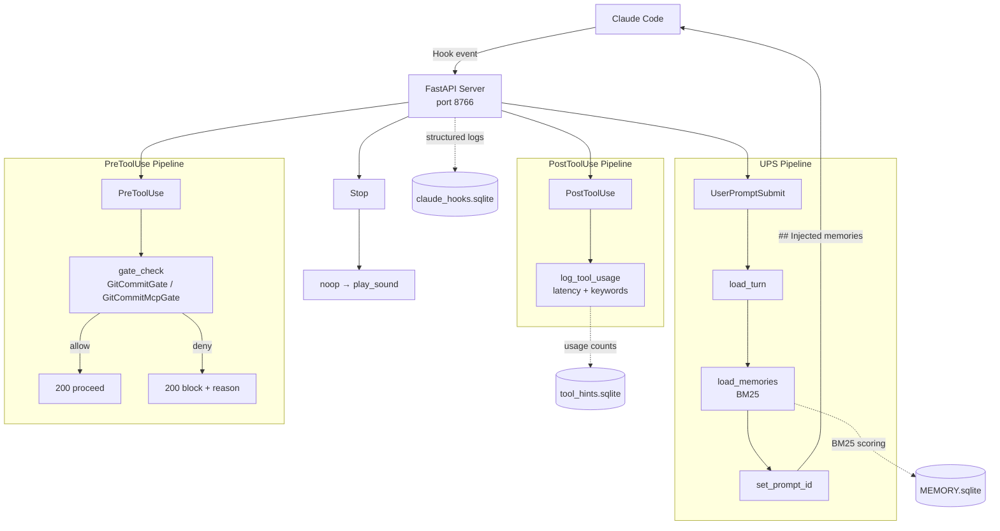

# claude-hooks Architecture

> This document describes the system as built — the decisions made, why they were made, and the constraints that shaped the design. Task tracking and the concept tools are not part of it: they live in the sibling [task-framework](https://github.com/debaditya-mohankudo/Lite-Task-Framework) project, which this repo calls (fail-open) but never the reverse.

---

## Overview

`claude-hooks` is a Python system that intercepts Claude Code hook events and runs a **LangGraph StateGraph pipeline** in response. Its responsibilities are:

1. **Memory injection** — score and inject relevant memories from `MEMORY.sqlite` into every prompt (BM25 over tags plus slug words; skill-tagged memories on a `Skill` call)
2. **Commit traceability gating** — deny a `git commit` that carries no `task:<id>` reference
3. **Tool usage tracking** — accumulate latency and keyword signals per MCP tool in `tool_hints.sqlite`
4. **Observability** — structured logs in `claude_hooks.sqlite` and a rolling cross-session event log (`server_memory.sqlite`)
5. **Tool-call side effects** — the WebSearch cache, find_cli and prompt-shadow hit-rate logs, vault reindexing, the context-size nudge and skill-tagged memory injection. The dispatcher runs these around the graph, not inside it (see [The graph](#the-graph))

---

## Subsystems

- **HookServer** — FastAPI server (`hooks/server.py`, port 8766), `hooks/dispatcher.py` event handlers, the gates in `hooks/gates.py`, and the session memory timeline. Routes: `/hook/{UserPromptSubmit,PreToolUse,PostToolUse,Stop,SessionStart,SessionEnd}` plus `/health` and `/session*` read endpoints. Owns the checkpointer lifecycle.
- **LangGraphPipeline** — `StateGraph(SessionState)` in `langchain_learning/session_graph.py`, 8 registered nodes, checkpointed by `MemorySaver` (`SqliteSaver` was retired after two corruption incidents, task:b3964f85).
- **ToolHandlers** — the `handle_*` functions in `src/tools/*`: 5 domains, 24 actions (`hooks`, `memory`, `think`, `scratch`, `vault_map`). `DOMAIN_MAP` in `src/dispatcher.py` is the authoritative list. The live front-end is cli-graph's `mac hooks …` / `mac memory …`, which imports the handlers through a subprocess runner. **`mcp_server.py` is dormant, kept on purpose:** no Claude Code config connects to it (`claude-hooks` is in `disabledMcpServers`), so `hooks__*` / `memory__*` MCP tools do not exist in a session. `tests/test_src_dispatcher.py` keeps it from rotting while dormant.
- **Stores** — `MEMORY.sqlite` (memories, BM25), `tool_hints.sqlite`, `claude_hooks.sqlite` (logs), `server_memory.sqlite` (event log). `concept_store/concepts.json` holds per-module architectural facts.
- **Foundation** — config (`src/config.py`), DB schema (`src/db/schema.py`), logging. Cross-cutting, not a peer subsystem.

## The graph

Ground truth: `langchain_learning/session_graph.py:build_session_graph()`. One graph, routed on `event_type`:

| Event | Path |
| --- | --- |
| `UserPromptSubmit` | `load_turn` → `load_memories` → `set_prompt_id` → END |
| `PreToolUse` | `gate_check` → END |
| `PostToolUse` | `log_tool_usage` → END |
| `Stop` / unknown | `noop` → `play_sound` → END |

After the graph returns, the dispatcher assembles `additionalContext` (`## Turn state`, user context, `## Injected memories`), trims it to the budget, and the response flows back through server → client → Claude Code.

Not everything runs in the graph. The dispatcher's handlers run side effects around it, each fail-open and none touching `SessionState`:

| Event | Outside the graph (`hooks/dispatcher.py`) |
| --- | --- |
| `UserPromptSubmit` | prompt shadow (`src/tools/prompt_shadow.py`); user-context render after the graph |
| `PreToolUse` | WebSearch cache: a fresh hit is returned as a deny carrying the cached result (`src/tools/web_search_cache.py`) |
| `PostToolUse` | WebSearch store, find_cli log, prompt-shadow linking, vault reindex (command and file-tool), context-size nudge, skill memories and skill-tag nudge — all before `log_tool_usage` |

The client (`hooks/client.py`) also writes terminal state itself before the POST — kitty tab status, dashboard plan/turn and the saved last response — because only its process has the session's `KITTY_*` environment.

The task pipeline that used to sit in this graph (`load_active_task`, `load_task_code`, `load_related_commits`, `load_related_tasks`, `load_task_history`, `summarize_task_context`, `log_task_events`, `activate_task`, `deactivate_task`) and the tool-scoring and domain-detection nodes (`score_tools`, `cwd_domain_detect`) are gone. Tombstone comments in `session_graph.py` name the task and reason for each; read them before re-adding any of these. The backfill slot (`backfill_memory_files.py`) is unwired but kept on disk — see [Pluggable Nodes](pluggable_nodes.md).

## Gates

`hooks/gates.py` keeps two gates, both on the commit path and neither touching a task store: `GitCommitGate` (Bash — regexes the command, or a file passed via `-F`, for `task:<id>`) and `GitCommitMcpGate` (`git__commit` — requires a non-empty `task_id` param). The `imessage__send` / `mail__delete` gates moved to LocalMacMCP; the task-lifecycle gates were removed when task storage moved to task-framework.

## Requirements traceability

| Requirement | Source | Satisfied by |
| --- | --- | --- |
| Commit ↔ task traceability | concept: `gates-commit-traceability` | `HookServer` |
| Additive-only migrations | concept: `db-schema-ddl-and-migrations` invariant | `Foundation` |
| Checkpoint non-persistence | [Development Workflow](dev-workflow.md) | `LangGraphPipeline` |
| Memory scoring global batch limit | concept: `memory-scoring-global-batch-limit` | `Stores` |

The enforced model lives in `models/*.sysml` and is checked by `tests/test_models.py`; verify a row against `concept_store/concepts.json` before relying on it.

---

## Design Principles

- **Hooks orchestrate; MCP servers own domain logic.** Project databases stay inside MCP servers — hooks never reach across that boundary.
- **All safety decisions are deterministic and explainable.** Gate checks are rule-based, not probabilistic.
- **Fail open.** A server that is down, a gate that errors, a parse that fails — none may block the user's tool call. `client.py` has no fallback: on any error (unreachable server, timeout after 2 s, a 500 from a handler) it prints `{}`, which allows the call and injects nothing. `dispatcher.main()` is the subprocess entry point tests use, not a production path.
- **Cross-hook state lives in the server process.** `SessionState` in the LangGraph checkpoint carries the turn and prompt fields the graph nodes share. Side effects outside the graph keep their own small per-session dicts (e.g. the context-nudge band, the skill-memory bookkeeping in `_skill_memories.py`). Both are in-memory and lost on restart — no DB-as-IPC.
- **Modular graph nodes that can evolve independently.** Each node is a callable class registered in `nodes/registry.py`. In practice most behaviour added since the task pipeline left has gone into dispatcher side effects instead (table above); which of the two is the orchestrator is an open decision (architecture review 2026-11-23, #3).

---

## Design Constraints

- Low-latency execution on every hook — every millisecond is user-perceived latency
- Persistent session state across prompts without relying on Claude's in-context memory (in-process only: checkpoints do not survive a server restart)
- No direct access to project databases — hooks only touch their own DBs
- Deterministic gate evaluation — no heuristics that can false-positive on normal prompts

---

## System Diagram

```mermaid
flowchart TD
    CC[Claude Code] -->|Hook event| FS[FastAPI Server\nport 8766]

    FS --> UPS[UserPromptSubmit]
    FS --> PTU_pre[PreToolUse]
    FS --> PTU_post[PostToolUse]
    FS --> STOP[Stop]

    subgraph UPS Pipeline
        UPS --> LT[load_turn]
        LT --> LM[load_memories\nBM25]
        LM --> SP[set_prompt_id]
    end

    subgraph PreToolUse Pipeline
        PTU_pre --> GC[gate_check\nGitCommitGate / GitCommitMcpGate]
        GC -->|allow| ALLOW[200 proceed]
        GC -->|deny| BLOCK[200 block + reason]
    end

    subgraph PostToolUse Pipeline
        PTU_post --> LU[log_tool_usage\nlatency + keywords]
    end

    STOP --> NOOP[noop → play_sound]

    SP -->|"## Injected memories"| CC

    LM -.->|BM25 scoring| MEMDB[(MEMORY.sqlite)]
    LU -.->|usage counts| THDB[(tool_hints.sqlite)]
    FS -.->|structured logs| LOGDB[(claude_hooks.sqlite)]
```

---

## Sections

- [Setup Guide](setup.md) — Getting claude-hooks running from scratch; database creation, hook registration, env vars
- [Pluggable Nodes](pluggable_nodes.md) — the backfill extension slot
- [Development Workflow](dev-workflow.md) · [Testing](testing.md) · [Skills](skills.md)
